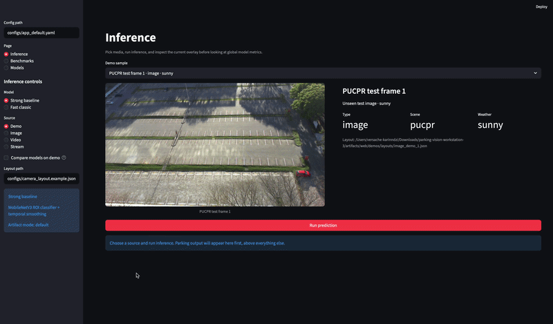

# Parking Vision Workstation


Camera-based parking occupancy detection from fixed cameras — comparing a MobileNetV3 deep learning baseline against a classical CV pipeline.

---

## Highlights

- **Dual-model design**: MobileNetV3 fine-tuned classifier (Model A) vs. handcrafted feature + logistic regression pipeline (Model B)
- **Per-slot ROI inference**: fixed-slot polygon layout JSON for each camera, lightweight crop-based classification
- **Temporal hysteresis smoothing** on video and RTSP stream inputs to reduce flicker
- **Streamlit dashboard**: image / video / RTSP stream upload, side-by-side model comparison, slot overlay visualization
- **Auto-download pipeline**: PKLot dataset via HuggingFace Hub; CNRPark+EXT adapter included
- **Unified evaluation**: same test split, same metrics — accuracy, F1, latency, FPS, memory

---

## Demo
<p></p>
> Upload an image or video in the Streamlit dashboard — each slot polygon is colored green (free), red (occupied), or amber (unknown).

---

## Results

Evaluation on 4096-sample PKLot test split:

| Model | Accuracy | F1 macro | Latency (mean) | FPS |
|---|---|---|---|---|
| **Model A — MobileNetV3** | **99.9%** | **0.999** | 35 ms | 29 |
| Model B — Classical CV | 84.0% | 0.863 | 1.0 ms | 966 |

Model A achieves near-perfect accuracy; Model B runs ~35× faster on CPU with no GPU dependency.

---

## Architecture

```
Camera frame
    │
    ▼
Slot layout JSON  ──►  ROI crop per slot
                              │
              ┌───────────────┴───────────────┐
              ▼                               ▼
    Model A (MobileNetV3)         Model B (Classical CV)
    224×224, GPU/CPU              160×160, CPU only
    fine-tuned backbone           handcrafted features
    3-class softmax               logistic regression
              │                               │
              └───────────────┬───────────────┘
                              ▼
                  Temporal hysteresis filter
                              │
                              ▼
                  free / occupied / unknown
```

---

## Quickstart

```bash
python3 -m venv .venv
source .venv/bin/activate
pip install -U pip
pip install -r requirements.txt
pip install -e .
```

```bash
# 1. Download and prepare PKLot
python scripts/prepare_data.py --config configs/dataset_pklot.yaml

# 2. Train MobileNetV3 classifier
python scripts/train_model_a.py --config configs/model_a_mobilenetv3.yaml

# 3. Fit classical CV model
python scripts/fit_model_b.py --config configs/model_b_classic.yaml

# 4. Evaluate both on the same test split
python scripts/evaluate.py \
  --test-manifest data/manifests/test.csv \
  --model-a-config configs/model_a_mobilenetv3.yaml \
  --model-a-checkpoint runs/model_a/latest/best.pt \
  --model-b-config configs/model_b_classic.yaml \
  --model-b-artifact runs/model_b/latest/classic_model.joblib \
  --output-dir runs/eval/latest

# 5. Launch Streamlit dashboard
python scripts/run_app.py --config configs/app_default.yaml
```

---

## Models

### Model A — MobileNetV3 (strong baseline)

- `torchvision` MobileNetV3-Large backbone, fine-tuned on parking-slot crops
- Input: 224×224 RGB, classes: `free` / `occupied` / `unknown`
- Training: 12 epochs, batch 64, lr 3e-4, mixed precision (AMP)
- Temporal: 5-frame window, hysteresis thresholds 0.65 / 0.45

### Model B — Classical CV (fast baseline)

14 handcrafted features per slot crop:
- Gray-level: mean, std, median
- Gradient energy: Sobel magnitude (mean, std)
- Edge density: Canny ratio
- Texture: Laplacian variance, Shannon entropy
- Color: HSV saturation/value stats
- Optional delta-to-reference (background subtraction)

Preprocessing: shadow suppression via HSV equalization → 160×160 resize → logistic regression (grid search over C).

---

## Dataset

**PKLot** (default) — downloaded automatically from HuggingFace Hub:

```bash
python scripts/prepare_data.py --config configs/dataset_pklot.yaml
```

Produces `data/manifests/train.csv`, `val.csv`, `test.csv` (70 / 15 / 15 split).

**CNRPark+EXT** — adapter available at `src/parking_vision/data/adapters/cnrpark_ext.py`:

```bash
python scripts/prepare_data.py --config configs/dataset_cnrpark_ext.yaml
```

---

## Slot layout format

Each camera needs a JSON with polygon ROIs:

```json
{
  "camera_id": "lot-cam-01",
  "image_width": 1280,
  "image_height": 720,
  "slots": [
    {"slot_id": "A01", "polygon": [[105, 410], [200, 385], [235, 470], [120, 500]]}
  ]
}
```

Convert from a CSV annotation file:

```bash
python scripts/convert_slots.py \
  --input-csv my_slots.csv \
  --output-json configs/my_camera_layout.json \
  --camera-id lot-cam-01
```

---

## Project structure

```
parking-vision-workstation/
├── configs/                     # YAML configs + example camera layout
├── scripts/                     # CLI entry points
│   ├── prepare_data.py
│   ├── train_model_a.py
│   ├── fit_model_b.py
│   ├── evaluate.py
│   ├── run_app.py
│   └── convert_slots.py
└── src/parking_vision/
    ├── config.py                # YAML loader / merger
    ├── cli.py                   # Click CLI
    ├── data/                    # datasets, adapters, augmentations
    ├── models/                  # Model A, Model B, smoothing, factory
    ├── training/                # training loop, checkpoints, losses
    ├── evaluation/              # runner, metrics, reports
    ├── utils/                   # metrics, visualization, profiling, I/O
    └── web/                     # FastAPI + Streamlit dashboard
```

---

## Limitations

- Requires fixed camera and pre-defined slot layout per camera
- Sensitive to camera repositioning and severe domain shift
- RTSP support is functional but not hardened for multi-camera production scale
- PKLot / CNRPark+EXT are patch-centric — real deployments benefit from camera-specific fine-tuning
